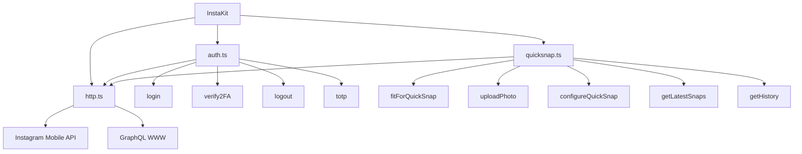
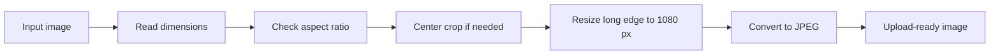
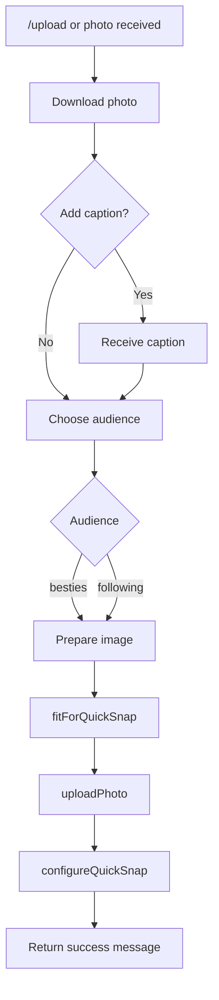

<p align="center">
  <h1 align="center">InstaKit</h1>
  <p align="center">
    TypeScript client for Instagram QuickSnap private API.
    <br />
    Reverse-engineered from the decrypted <code>com.burbn.moonshot</code> v430.0.1 IPA binary.
  </p>
</p>

<p align="center">
  <a href="https://www.typescriptlang.org/">
    
  </a>
  <a href="https://nodejs.org/">
    
  </a>
  
  
</p>

---

## Overview

**InstaKit** is a TypeScript client for Instagram's **QuickSnap**, internally known as **Instants** inside the `com.burbn.moonshot` app bundle.

QuickSnap is an ephemeral photo-sharing feature similar to a lightweight Polaroid-style camera. It publishes a full-bleed photo directly to Close Friends or followers and expires after 24 hours.

This project documents and implements:

- Authentication through Instagram mobile private API
- Two-factor login through SMS, TOTP, or WhatsApp
- Resumable photo upload through Instagram rupload
- QuickSnap configuration and publishing
- QuickSnap feed fetching through GraphQL
- QuickSnap history pagination
- Image preprocessing for accepted aspect ratios
- Telegram bot integration

> **Research notice**
>
> Instagram does not provide a public API for QuickSnap. This project was created for educational and reverse-engineering research purposes only.

---

## Table of Contents

- [Architecture](#architecture)
- [Reverse Engineering Methodology](#reverse-engineering-methodology)
- [API Reference](#api-reference)
  - [Base URL](#base-url)
  - [Authentication](#authentication)
  - [Two-Factor Authentication](#two-factor-authentication)
  - [Photo Upload](#photo-upload)
  - [Configure to QuickSnap](#configure-to-quicksnap)
  - [Audience Types](#audience-types)
  - [GraphQL: Friends QuickSnaps](#graphql-friends-quicksnaps)
  - [GraphQL: My QuickSnap History](#graphql-my-quicksnap-history)
- [HTTP Client and Session Model](#http-client-and-session-model)
- [Image Preprocessing](#image-preprocessing)
- [Telegram Bot](#telegram-bot)
- [Environment Variables](#environment-variables)
- [Running Locally](#running-locally)
- [Project Structure](#project-structure)
- [Disclaimer](#disclaimer)

---

## Architecture



### Core modules

| File | Responsibility |
|---|---|
| `auth.ts` | Login, logout, 2FA verification, TOTP generation |
| `http.ts` | Axios wrapper, headers, cookies, bearer token, interceptors |
| `quicksnap.ts` | Image preprocessing, photo upload, configure step, GraphQL queries |
| `client.ts` | Public InstaKit facade and interactive login |
| `constants.ts` | Endpoints, app version, GraphQL document IDs |
| `types.ts` | TypeScript interfaces |
| `bot.ts` | Telegram bot powered by grammY |

---

## Reverse Engineering Methodology

The QuickSnap API was reconstructed by analyzing Instagram's Moonshot iOS binary.

### Binary extraction process

```bash
strings Payload/Moonshot.app/Moonshot \
  | grep -E "configure_to_quick_snap|audience|besties|quick_snap"
```

### Key binary findings

| Extracted string | Source | Purpose |
|---|---|---|
| `media/configure_to_quick_snap/` | Binary literal | REST configure endpoint |
| `IGQuickSnapGetQuickSnapsQuery` | ObjC symbol/string | GraphQL operation |
| `IGQuickSnapGetHistoryPaginatedQuery` | ObjC symbol/string | GraphQL operation |
| `quick_snap_paginated_history(after:$after,first:$first)` | GraphQL literal | History pagination field |
| `besties` | Enum literal | Close Friends audience |
| `following` | Enum literal | Followers audience |
| `_uuid` | Form field literal | Configure payload key |
| `archive_only` | Form field literal | Configure payload key |
| `allow_multi_configures` | Form field literal | Configure payload key |
| `audience_list_id` | Field literal | Custom audience list field |

### GraphQL client document IDs

Persistent GraphQL query IDs were extracted from the embedded:

```text
igios-instagram-schema_client-persist.json
```

| Operation | `client_doc_id` |
|---|---|
| `IGQuickSnapGetQuickSnapsQuery` | `13779138909820036502671334714` |
| `IGQuickSnapGetHistoryPaginatedQuery` | `202528380815293408658525056594` |
| `IGQuickSnapUpdateSeenStateMutation` | `9154705964558259852151766741` |

---

# API Reference

## Base URL

```text
https://i.instagram.com/api/v1
```

All mobile requests use standard Instagram iOS headers.

```http
X-IG-App-ID: 124024574287414
X-IG-Capabilities: 3brTvwE=
X-IG-Connection-Type: WIFI
X-FB-HTTP-Engine: Liger
X-FB-Client-IP: True
X-FB-Server-Cluster: True
Accept-Language: en-US
User-Agent: Instagram 430.0.1 (iPhone14,3; iOS 16_6; en_US; en-US; scale=3.00; 1284x2778; 969327462) AppleWebKit
```

After login, the client also attaches session-bound headers and cookies.

```http
Authorization: Bearer <ig-set-authorization token>
X-CSRFToken: <csrftoken cookie>
Cookie: mid=...; ig-u-ds-user-id=...; sessionid=...; csrftoken=...
X-IG-Device-ID: <uuid4>
X-IG-Family-Device-ID: <uuid4>
```

---

## Authentication

### Endpoint

```http
POST /api/v1/accounts/login/
Content-Type: application/x-www-form-urlencoded
```

Before logging in, fetch a CSRF token:

```http
GET /api/v1/si/fetch_headers/?challenge_type=signup&guid=<uuid4>
```

This seeds the `csrftoken` cookie through `Set-Cookie`.

### Login payload

```text
username=<username>
enc_password=#PWD_INSTAGRAM:0:<unix_ts>:<plaintext_password>
device_id=<X-IG-Device-ID>
phone_id=<uuid4>
guid=<uuid4>
adid=<uuid4>
login_attempt_count=0
jazoest=<jazoest(phone_id)>
```

### `jazoest`

`jazoest` is calculated by summing the character codes of `phone_id`, then prefixing the result with `2`.

Example:

```text
phone_id = "abc"
97 + 98 + 99 = 294
jazoest = "2294"
```

### `enc_password`

The password is sent inside a versioned Instagram password envelope:

```text
#PWD_INSTAGRAM:0:<timestamp>:<password>
```

Version `0` indicates no client-side encryption. The timestamp is included for replay protection.

### Success response

```json
{
  "logged_in_user": {
    "pk": "53743547524",
    "username": "youruser"
  },
  "status": "ok"
}
```

Important response headers:

| Header | Usage |
|---|---|
| `ig-set-authorization` | Stored as bearer token |
| `ig-set-x-mid` | Stored as `mid` cookie |
| `ig-set-ig-u-ds-user-id` | Stored as user ID cookie |

### Two-factor response

```json
{
  "two_factor_required": true,
  "two_factor_info": {
    "username": "youruser",
    "two_factor_identifier": "<identifier>",
    "device_id": "<device_id>",
    "sms_two_factor_on": true,
    "totp_two_factor_on": false,
    "whatsapp_two_factor_on": false,
    "obfuscated_phone_number_2": "+84 **** **34"
  }
}
```

---

## Two-Factor Authentication

### Endpoint

```http
POST /api/v1/accounts/two_factor_login/
Content-Type: application/x-www-form-urlencoded
```

### Payload

```text
username=<username>
verification_code=<6-digit code>
two_factor_identifier=<from 2FA response>
trust_this_device=0
verification_method=<1|3|6>
device_id=<device_id>
```

### Verification methods

| Value | Method |
|---:|---|
| `1` | SMS |
| `3` | TOTP |
| `6` | WhatsApp |

### TOTP

TOTP generation is implemented natively without external dependencies.

| Property | Value |
|---|---|
| Standard | RFC 6238 |
| Algorithm | HMAC-SHA1 |
| Step | 30 seconds |
| Digits | 6 |
| Secret encoding | Base32 |

```typescript
const code = totp(base32Secret);
const previous = totp(base32Secret, -1);
```

---

## Photo Upload

Instagram uses a proprietary resumable upload protocol on a separate route.

### Endpoint

```http
POST https://i.instagram.com/rupload_igphoto/<upload_name>
```

### Upload name

```text
<upload_id>_0_<random_9_digit_number>
```

Where:

```typescript
const upload_id = String(Date.now());
```

### Required headers

```http
Content-Type: image/jpeg
X-Entity-Length: <byte_length_of_photo_buffer>
X-Entity-Name: <upload_name>
X-Instagram-Rupload-Params: <json>
Offset: 0
```

### `X-Instagram-Rupload-Params`

```json
{
  "upload_id": "1778775241011",
  "media_type": 1,
  "upload_media_width": 1080,
  "upload_media_height": 565,
  "image_compression": "{\"lib_name\":\"moz\",\"lib_version\":\"3.1.m\",\"quality\":\"80\"}"
}
```

| Field | Meaning |
|---|---|
| `upload_id` | Timestamp-based upload identifier |
| `media_type` | `1` for photo |
| `upload_media_width` | Final processed image width |
| `upload_media_height` | Final processed image height |
| `image_compression` | Optional compression metadata |

The request body is sent as raw image bytes, not multipart form data.

### Success response

```json
{
  "upload_id": "1778775241011",
  "status": "ok"
}
```

The response `upload_id` must match the sent `upload_id`.

---

## Configure to QuickSnap

This is the publish step. It converts an uploaded image into a live QuickSnap post.

### Endpoint

```http
POST /api/v1/media/configure_to_quick_snap/
Content-Type: application/x-www-form-urlencoded
```

### Payload

```text
_uuid=<uuid4>
upload_id=<upload_id from upload step>
caption=<string>
audience=<"besties"|"following">
recipient_users=[]
thread_ids=[]
client_timestamp=<unix_seconds>
device_timestamp=<unix_seconds>
timezone_offset=<seconds_east_of_UTC>
creation_surface=camera
camera_position=back
archive_only=0
allow_multi_configures=0
upload_media_width=<int>
upload_media_height=<int>
```

### Important fields

| Field | Requirement |
|---|---|
| `_uuid` | Fresh UUID4. Must stay consistent between upload and configure for the same post |
| `upload_id` | Returned by the rupload step |
| `audience` | Either `besties` or `following` |
| `timezone_offset` | `new Date().getTimezoneOffset() * -60` |
| `archive_only` | Usually `0` |
| `allow_multi_configures` | Usually `0` |

### Success response

```json
{
  "media": {
    "id": "3896971727343812018_53743547524",
    "strong_id__": "3896971727343812018_53743547524",
    "subtype_name_for_REST__": "XDTQuickSnapMedia",
    "taken_at": 1778775252,
    "expiring_at": 1778861652,
    "media_type": 1,
    "original_width": 1080,
    "original_height": 565,
    "caption": {
      "text": "your caption here"
    },
    "image_versions2": {
      "candidates": [
        {
          "width": 1080,
          "height": 565,
          "url": "https://instagram.fsgn5-15.fna.fbcdn.net/..."
        }
      ]
    }
  },
  "status": "ok"
}
```

> **Integrity review**
>
> `integrity_review_decision` may be `pending` immediately after publishing. This is expected because Instagram moderation runs asynchronously.

---

## Audience Types

| Value | Visibility |
|---|---|
| `besties` | Close Friends |
| `following` | All followers |

These values were extracted directly from the Moonshot Mach-O binary as Objective-C string constants.

---

## GraphQL: Friends QuickSnaps

Fetches active QuickSnaps from accounts the authenticated user follows.

### Endpoint

```http
POST https://i.instagram.com/graphql_www
Content-Type: application/x-www-form-urlencoded
```

### Body

```text
fb_api_req_friendly_name=IGQuickSnapGetQuickSnapsQuery
client_doc_id=13779138909820036502671334714
variables={"request":{}}
server_timestamps=true
```

### Response path

```text
data.xdt_get_quick_snaps.items_ordered_by_time[]
```

Each item is an `XDTMediaDict`, matching the same media shape returned by the configure endpoint.

---

## GraphQL: My QuickSnap History

Fetches paginated history of the authenticated user's QuickSnap posts.

### Endpoint

```http
POST https://i.instagram.com/graphql_www
```

### First request

```text
fb_api_req_friendly_name=IGQuickSnapGetHistoryPaginatedQuery
client_doc_id=202528380815293408658525056594
variables={"first":12}
server_timestamps=true
```

### Paginated request

```text
fb_api_req_friendly_name=IGQuickSnapGetHistoryPaginatedQuery
client_doc_id=202528380815293408658525056594
variables={"first":12,"after":"<cursor>"}
server_timestamps=true
```

### GraphQL field

```text
quick_snap_paginated_history(after:$after, first:$first)
```

### Response paths

```text
data.viewer.quick_snap_paginated_history.edges[].node
data.viewer.quick_snap_paginated_history.page_info
```

`page_info` contains:

```json
{
  "has_next_page": true,
  "end_cursor": "<cursor>"
}
```

---

# HTTP Client and Session Model

The `HttpClient` class wraps Axios and provides automatic session behavior.

## Features

| Feature | Description |
|---|---|
| Header injection | Adds Instagram mobile headers to every request |
| Cookie harvesting | Extracts and stores cookies from responses |
| Bearer token storage | Captures `ig-set-authorization` |
| User cookie storage | Captures `ig-set-ig-u-*` cookies |
| Full error visibility | Preserves non-2xx response bodies |
| Persistent sessions | Saves login state to JSON |

## Axios status handling

```typescript
validateStatus: () => true
```

All HTTP responses are passed through to the caller. Non-2xx responses are converted into detailed errors with the original Instagram response body attached.

## Session object

```typescript
interface Session {
  userId: string;
  username: string;
  authToken: string;
  csrfToken: string;
  deviceId: string;
  familyDeviceId: string;
  phoneId: string;
  mid: string;
  cookies: Record<string, string>;
}
```

Sessions are serializable and persisted as JSON files. This avoids requiring login after every bot restart.

---

# Image Preprocessing

QuickSnap enforces strict image constraints. Images outside these bounds may fail during the configure step with a generic server error.

## Constraints

| Constraint | Limit |
|---|---|
| Maximum landscape ratio | `1.91 : 1` |
| Maximum portrait ratio | `0.5625 : 1` |
| Maximum long edge | `1080 px` |

## Processing pipeline



## `fitForQuickSnap(buf, mime)`

This helper automatically prepares images for QuickSnap.

| Step | Behavior |
|---|---|
| Aspect ratio enforcement | Crops landscape images to `1.91:1` and portrait images to `9:16` |
| Downscaling | Resizes images whose long edge exceeds `1080 px` |
| Format normalization | Outputs JPEG with quality `90` |

Example:

| Input | Ratio | Output |
|---|---:|---|
| `2532 x 1170` | `2.17` | `1080 x 565` |

---

# Telegram Bot

`bot.ts` provides a production-ready Telegram bot interface for InstaKit.

## Commands

| Command | Description |
|---|---|
| `/start` | Show help |
| `/login <user> <pass> [totp_secret]` | Authenticate with Instagram |
| `/upload` | Begin photo upload flow |
| `/history` | Fetch full paginated QuickSnap history |
| `/feed` | Show active QuickSnaps from friends |
| `/logout` | Invalidate session and remove stored credentials |

## Upload flow



## Session persistence

Sessions are stored using this format:

```text
./sessions/session_<telegram_user_id>_<ig_username>.json
```

Before prompting for login, the bot attempts to restore an existing session from disk.

---

# Environment Variables

| Variable | Required | Description |
|---|---|---|
| `BOT_TOKEN` | Yes | Telegram Bot API token from BotFather |
| `IG_SESSION_DIR` | No | Directory for session JSON files. Defaults to `./sessions` |
| `IG_DEBUG` | No | Set to `1` to enable verbose request and response logging |

## Debug output

When `IG_DEBUG=1`, logs are written to stderr.

```text
[FIT] 2532x1170 (ratio 2.16) -> 1080x565 (jpeg)
[SEND] audience=besties caption="..." dims=1080x565 size=192739B
[UPLOAD RESPONSE] {"upload_id":"...","status":"ok"}
[CONFIGURE PAYLOAD] {"_uuid":"...","upload_id":"...","caption":"..."}
[CONFIGURE RESPONSE] {"media":{...}}
[PARSED CAPTION] "your caption"
[BOT] result.caption="..." savedCaption="..."
[GQL RAW] IGQuickSnapGetQuickSnapsQuery {...}
```

---

# Running Locally

## Prerequisites

- Node.js 18 or newer
- npm

## Install dependencies

```bash
npm install
```

## Run the Telegram bot

```bash
BOT_TOKEN=<your_token> npx ts-node bot.ts
```

## Run with debug logging

```bash
BOT_TOKEN=<your_token> IG_DEBUG=1 npx ts-node bot.ts
```

## Run CLI smoke test

```bash
IG_USER=youruser IG_PASS=yourpass npx ts-node test.ts
```

## Test with photo upload

```bash
IG_USER=youruser IG_PASS=yourpass \
IG_PHOTO=./photo.jpg \
IG_CAPTION="test caption" \
IG_AUDIENCE=besties \
npx ts-node test.ts
```

## Test with automatic TOTP 2FA

```bash
IG_USER=youruser \
IG_PASS=yourpass \
IG_TOTP_SECRET=BASE32SECRET \
npx ts-node test.ts
```

---

# Project Structure

```text
instakit/
|-- src/
|   |-- auth.ts
|   |-- client.ts
|   |-- constants.ts
|   |-- http.ts
|   |-- quicksnap.ts
|   |-- types.ts
|   `-- index.ts
|-- bot.ts
|-- test.ts
`-- sessions/
```

## File map

| Path | Purpose |
|---|---|
| `src/auth.ts` | Login, 2FA, logout, TOTP |
| `src/client.ts` | InstaKit facade class and interactive login |
| `src/constants.ts` | Endpoints, app version, GraphQL document IDs |
| `src/http.ts` | Axios wrapper and cookie handling |
| `src/quicksnap.ts` | Upload, configure, feed, history, preprocessing |
| `src/types.ts` | TypeScript interfaces |
| `src/index.ts` | Public exports |
| `bot.ts` | Telegram bot |
| `test.ts` | CLI smoke test |
| `sessions/` | Persisted session JSON files, usually gitignored |

---

# Disclaimer

This library interfaces with Instagram's private and undocumented mobile API. It was created for educational and research purposes through binary analysis.

This project is not affiliated with, endorsed by, or supported by Meta Platforms, Inc.

Use of this library may violate Instagram's Terms of Use. Private API endpoints can change at any time without notice, which may break this library.

The author assumes no responsibility for account suspension, data loss, API breakage, or any other consequence resulting from use of this software.

Use at your own risk.
